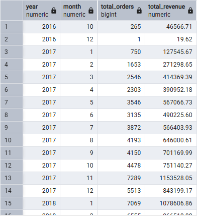
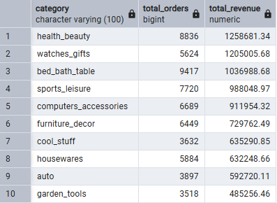
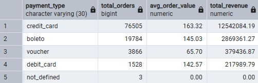
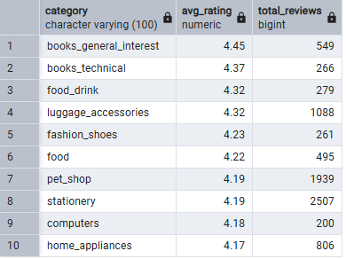
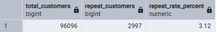
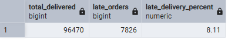
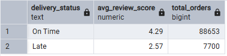
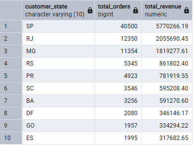

# Olist E-Commerce SQL Analysis
### Exploratory Data Analysis using PostgreSQL

 

---

## Project Overview

This project performs an end-to-end exploratory data analysis on the **Olist Brazilian E-Commerce dataset** — a real-world dataset of 100,000+ orders placed between 2016 and 2018 across multiple Brazilian marketplaces.

The goal was to answer key business questions around revenue trends, customer behavior, product performance, delivery logistics, and seller analysis using **pure SQL** in PostgreSQL.

---

## Database Schema

The analysis uses 8 relational tables loaded into PostgreSQL:

| Table | Description | Rows |
|-------|-------------|------|
| orders | Core order data with status and timestamps | 99,441 |
| customers | Customer location and ID info | 99,441 |
| order_items | Products within each order | 112,650 |
| order_payments | Payment method and value per order | 103,886 |
| order_reviews | Customer review scores and comments | 99,224 |
| products | Product attributes and category | 32,951 |
| sellers | Seller location info | 3,095 |
| product_category_translation | Portuguese to English category names | 71 |

---

## Data Validation

Before analysis, a quick data quality check was performed:

- **97% of orders (96,478 out of 99,441) have 'delivered' status** — confirming the dataset is reliable for revenue and delivery analysis
- Remaining orders are split across: shipped (1,107), cancelled (625), unavailable (609), and other statuses
- All analysis queries filter to `WHERE order_status = 'delivered'` to ensure accuracy
- Null timestamps handled within individual queries

---

## Business Questions & Analysis

---

### Q1 — How has revenue and order volume grown over time?

**Key Findings:**
- Business launched October 2016 with just 265 orders and $46,566 revenue
- Grew consistently throughout 2017, reaching 4,000+ orders/month by mid-year
- **November 2017 spike: 7,289 orders and $1,153,528 revenue** — strong Black Friday effect
- By 2018, platform stabilized at 6,000–7,000 orders per month consistently
- Peak revenue month: March 2018 at $1,120,678



```sql
SELECT 
    EXTRACT(YEAR FROM order_purchase_timestamp) AS year,
    EXTRACT(MONTH FROM order_purchase_timestamp) AS month,
    COUNT(DISTINCT o.order_id) AS total_orders,
    ROUND(SUM(p.payment_value)::numeric, 2) AS total_revenue
FROM orders o
JOIN order_payments p ON o.order_id = p.order_id
WHERE order_status = 'delivered'
GROUP BY year, month
ORDER BY year, month;
```

---

### Q2 — Which product categories drive the most revenue?

**Key Findings:**
- **health_beauty** is the top revenue category: $1,258,681 from 8,836 orders
- **bed_bath_table** has the highest order volume (9,417) but ranks 3rd in revenue
- This gap reveals that health/beauty products command a higher average price
- **watches_gifts** earns $1,205,005 despite fewer orders than bed_bath_table — premium pricing
- Bottom of top 10: garden_tools at $485,256



```sql
SELECT 
    t.product_category_name_english AS category,
    COUNT(DISTINCT oi.order_id) AS total_orders,
    ROUND(SUM(oi.price)::numeric, 2) AS total_revenue
FROM order_items oi
JOIN products p ON oi.product_id = p.product_id
JOIN product_category_translation t ON p.product_category_name = t.product_category_name
GROUP BY category
ORDER BY total_revenue DESC
LIMIT 10;
```

---

### Q3 — Which payment methods do customers prefer?

**Key Findings:**
- **Credit card dominates**: 76,505 orders (77% of all transactions), $12.5M total revenue
- Credit card has the highest average order value at **$163.32**
- **Boleto** (Brazilian bank slip) is 2nd with 19,784 orders — shows a large segment of customers without credit cards
- Vouchers have lowest average value ($65.70) — used mainly for discounted/small purchases
- Debit card is barely used despite similar average value to boleto



```sql
SELECT 
    payment_type,
    COUNT(DISTINCT order_id) AS total_orders,
    ROUND(AVG(payment_value)::numeric, 2) AS avg_order_value,
    ROUND(SUM(payment_value)::numeric, 2) AS total_revenue
FROM order_payments
GROUP BY payment_type
ORDER BY total_revenue DESC;
```

---

### Q4 — How long does delivery take?

**Key Findings:**
- **Average delivery time: 12.6 days** — relatively long for e-commerce
- Fastest delivery: 0.5 days (same/next day)
- Slowest delivery: 209.6 days — extreme outlier, likely a logistics failure
- Long average delivery time is a platform-wide concern that directly impacts customer satisfaction (see Q8)

```sql
SELECT 
    ROUND(AVG(EXTRACT(EPOCH FROM (order_delivered_customer_date - order_purchase_timestamp))/86400)::numeric, 1) AS avg_delivery_days,
    ROUND(MIN(EXTRACT(EPOCH FROM (order_delivered_customer_date - order_purchase_timestamp))/86400)::numeric, 1) AS min_delivery_days,
    ROUND(MAX(EXTRACT(EPOCH FROM (order_delivered_customer_date - order_purchase_timestamp))/86400)::numeric, 1) AS max_delivery_days
FROM orders
WHERE order_status = 'delivered'
AND order_delivered_customer_date IS NOT NULL;
```

---

### Q5 — Which product categories have the highest customer satisfaction?

**Key Findings:**
- **Books lead satisfaction**: general interest (4.45/5) and technical books (4.37/5)
- Food & drink scores well (4.32) — physical consumable products are reliably satisfying
- Pet shop has strong rating (4.19) with high review volume (1,939) — a consistently reliable category
- **No electronics or tech categories appear in the top 10** — suggests tech products generate more complaints
- High-volume categories like stationery (2,507 reviews, 4.19 avg) show consistency at scale



```sql
SELECT 
    t.product_category_name_english AS category,
    ROUND(AVG(r.review_score)::numeric, 2) AS avg_rating,
    COUNT(r.review_id) AS total_reviews
FROM order_reviews r
JOIN order_items oi ON r.order_id = oi.order_id
JOIN products p ON oi.product_id = p.product_id
JOIN product_category_translation t ON p.product_category_name = t.product_category_name
GROUP BY category
HAVING COUNT(r.review_id) > 100
ORDER BY avg_rating DESC
LIMIT 10;
```

---

### Q6 — How many customers return for a second purchase?

**Key Findings:**
- **Only 3.12% of customers made more than one purchase** (2,997 out of 96,096)
- This is critically low — Olist is almost entirely dependent on acquiring new customers
- Improving retention even by 2–3% could significantly impact long-term revenue
- **Customer retention is the single biggest growth opportunity on the platform**



```sql
SELECT 
    COUNT(*) AS total_customers,
    SUM(CASE WHEN order_count > 1 THEN 1 ELSE 0 END) AS repeat_customers,
    ROUND(SUM(CASE WHEN order_count > 1 THEN 1 ELSE 0 END) * 100.0 / COUNT(*), 2) AS repeat_rate_percent
FROM (
    SELECT 
        customer_unique_id,
        COUNT(o.order_id) AS order_count
    FROM customers c
    JOIN orders o ON c.customer_id = o.customer_id
    GROUP BY customer_unique_id
) customer_orders;
```

---

### Q7 — What percentage of orders are delivered late?

**Key Findings:**
- **8.11% of orders arrive late** (7,826 out of 96,470 delivered orders)
- Roughly 1 in every 12 customers receives a late delivery
- Combined with the 12.6 day average (Q4), logistics is a clear weak point
- Late deliveries have a severe impact on ratings — see Q8



```sql
SELECT
    COUNT(*) AS total_delivered,
    SUM(CASE WHEN order_delivered_customer_date > order_estimated_delivery_date 
        THEN 1 ELSE 0 END) AS late_orders,
    ROUND(SUM(CASE WHEN order_delivered_customer_date > order_estimated_delivery_date 
        THEN 1 ELSE 0 END) * 100.0 / COUNT(*), 2) AS late_delivery_percent
FROM orders
WHERE order_status = 'delivered'
AND order_delivered_customer_date IS NOT NULL
AND order_estimated_delivery_date IS NOT NULL;
```

---

### Q8 — Does late delivery hurt customer review scores?

**Key Findings:**
- On-time delivery average rating: **4.29 / 5**
- Late delivery average rating: **2.57 / 5**
- **Late delivery drops satisfaction by 1.72 points — a 40% decrease**
- This is the most actionable finding in the entire analysis
- Fixing late deliveries would directly improve platform ratings and customer retention



```sql
SELECT
    CASE WHEN order_delivered_customer_date > order_estimated_delivery_date 
        THEN 'Late' ELSE 'On Time' END AS delivery_status,
    ROUND(AVG(r.review_score)::numeric, 2) AS avg_review_score,
    COUNT(*) AS total_orders
FROM orders o
JOIN order_reviews r ON o.order_id = r.order_id
WHERE order_status = 'delivered'
AND order_delivered_customer_date IS NOT NULL
GROUP BY delivery_status;
```

---

### Q9 — Which sellers generate the most revenue?

**Key Findings:**
- Top seller (Guariba, SP): 1,132 orders, **$229,472 revenue**
- **8 out of top 10 sellers are from São Paulo state** — reflects Brazil's economic concentration
- The seller with the most orders (1,806 from Ibitinga) is NOT the highest revenue seller — different pricing strategy
- One outlier in top 10: seller from Bahia (BA) ranks 2nd in revenue despite being outside SP

```sql
SELECT 
    s.seller_id,
    s.seller_city,
    s.seller_state,
    COUNT(DISTINCT oi.order_id) AS total_orders,
    ROUND(SUM(oi.price)::numeric, 2) AS total_revenue
FROM order_items oi
JOIN sellers s ON oi.seller_id = s.seller_id
GROUP BY s.seller_id, s.seller_city, s.seller_state
ORDER BY total_revenue DESC
LIMIT 10;
```

---

### Q10 — Which regions drive the most sales?

**Key Findings:**
- **São Paulo (SP) dominates**: 40,500 orders, $5.77M revenue — **38% of total platform revenue**
- Top 3 states (SP, RJ, MG) account for the majority of all transactions
- Heavy concentration in Southeast Brazil reflects population and income distribution
- Southern states (RS, PR, SC) show solid volume — potential for targeted growth campaigns



```sql
SELECT 
    c.customer_state,
    COUNT(DISTINCT o.order_id) AS total_orders,
    ROUND(SUM(p.payment_value)::numeric, 2) AS total_revenue
FROM orders o
JOIN customers c ON o.customer_id = c.customer_id
JOIN order_payments p ON o.order_id = p.order_id
WHERE o.order_status = 'delivered'
GROUP BY c.customer_state
ORDER BY total_revenue DESC
LIMIT 10;
```

---

## Key Insights Summary

| # | Insight | Impact |
|---|---------|--------|
| 1 | Revenue grew 24x from Oct 2016 to early 2018 | Platform is in strong growth phase |
| 2 | health_beauty earns most despite bed_bath_table having more orders | Pricing strategy matters more than volume |
| 3 | 77% of payments are by credit card with highest avg value ($163) | Credit-focused customers are most valuable |
| 4 | Average delivery is 12.6 days | Logistics needs improvement |
| 5 | Only 3.12% of customers return for a second purchase | Retention is the biggest growth opportunity |
| 6 | Late delivery drops ratings from 4.29 to 2.57 (40% drop) | Fixing logistics = fixing customer satisfaction |
| 7 | São Paulo drives 38% of all revenue | Geographic concentration is a risk |

---

## Tools Used

- **PostgreSQL 16** — Database management
- **pgAdmin 4** — Query execution and data import
- **Dataset** — [Olist Brazilian E-Commerce on Kaggle](https://www.kaggle.com/datasets/olistbr/brazilian-ecommerce)

---

## Repository Structure
```
olist-ecommerce-sql-analysis/
│
├── queries.sql          # All 10 analysis queries
├── README.md            # This file
└── screenshots/         # Query result screenshots
```

---

*Analysis by Hajra | PIEAS BS Computer & Information Sciences*
